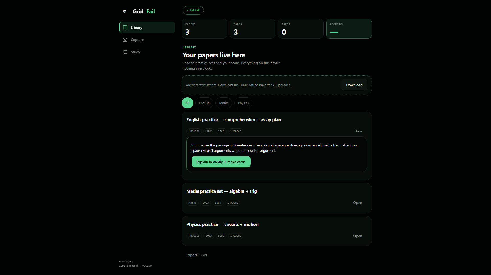
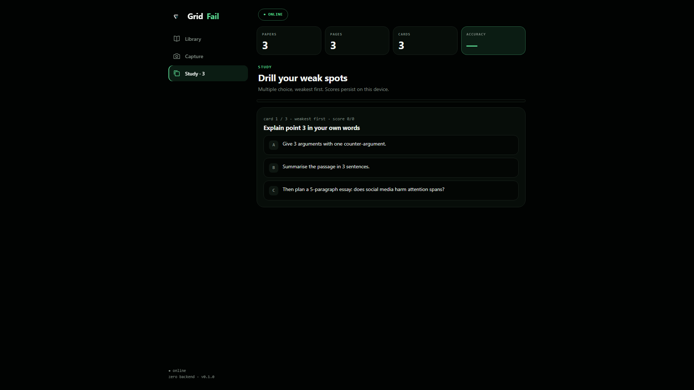

# Changelog

All notable changes to GridFail. Format follows [Keep a Changelog](https://keepachangelog.com/en/1.1.0/),
versioning follows SemVer once 1.0 ships.

## [0.1.0] — 2026-10-04

First public release — HACK47 OFFGRID submission. GridFail is an offline-first
study kit: photograph a past paper, get a plain-language breakdown, drill it as
flashcards and quizzes, all on-device in IndexedDB with no backend.

### Answers now, AI upgrade in the background

Problem: Explain downloaded a ~80MB model on first tap, so the first answer
took too long for a between-classes tool. Change: `instant()` renders an
extractive breakdown in milliseconds; `upgrade()` then tries cloud (if
`VITE_OPENAI_KEY` set) or the on-device LaMini-Flan-T5-77M in the background
and relabels the result (`instant` / `cloud` / `on-device AI`). Core works at
0MB downloaded. How-to: (1) In Library, open a paper with Open, then tap
`Explain instantly + make cards`. (2) For the model upgrade, tap `Download`
in the panel above the subject chips. See [src/lib/ai.ts](src/lib/ai.ts) and
the explain path in [src/App.tsx](src/App.tsx).

What you're seeing: English card expanded with its `Hide` button visible and
the green `Explain instantly + make cards` button under the page text. Other
papers stay collapsed with `Open`. Pill row reads subject, year, `seed`,
`1 pages`.

### A connection indicator that tells the truth

Problem: the first pill read `navigator.onLine`, which lies on flaky school
networks. A fake green pill fails OFFGRID judging. Change: `useOnline()` in
`src/App.tsx` fires a same-origin `HEAD /favicon.svg` probe every 3 seconds
and renders `● ONLINE` or `○ OFFLINE — fully working`. How-to: (1) Load the
app once online so the shell caches. (2) Cut network (airplane mode); the
pill top-center flips to `○ OFFLINE — fully working` and study keeps working.
See [src/App.tsx](src/App.tsx) (`useOnline`, `net-pill`).

What you're seeing: green `○ OFFLINE — fully working` pill top-center above
the stats strip (`3 papers, 3 pages, 3 cards`). Sidebar shows Library active
and the `Download` panel reads "Answers start instant. Download the 80MB
offline brain for AI upgrades."

### Quizzes start with your weakest card

Problem: quizzes ran in creation order, wasting short sessions on known
cards. Change: Study sorts by per-page accuracy (missed pages first, unseen
cards before seen) and draws distractors from your other cards' answers.
Header tracks `card 1 / 3 · weakest first · score 0/0`. How-to: (1) Tap the
`Study` tab in the sidebar. (2) Tap an answer, then `Next card` when it
appears; score updates as `ok/total`. See the `Study` component in
[src/App.tsx](src/App.tsx) and the drill path in [DEMO.md](DEMO.md).

What you're seeing: `Study · 3` active in the sidebar with the `● ONLINE`
pill top-center. Card header reads `card 1 / 3 · weakest first · score 0/0`
above the question, with three tappable answer buttons and a thin progress
bar on top.

### From paper photo to study deck without leaving the device

Problem: getting a paper into the app needed manual typing. Change: Capture
runs Tesseract.js OCR on the photo, Explain turns the text into cards, and
everything lands in IndexedDB. Library keeps a stats strip (papers, pages,
cards, accuracy), subject chips, and `Export JSON` backup. How-to: (1) Tap
the `Capture` tab, then `Take / upload photo`, then `Read text`, then
`Save to library`. (2) Back in `Library`, filter with `All / English /
Maths / Physics` or tap `Export JSON` at the bottom. See the `Capture` and
`Library` components in [src/App.tsx](src/App.tsx).

What you're seeing: `Library` active with the `● ONLINE` pill top-center and
stats `3 papers, 3 pages, 0 cards`. The `Download` panel sits above the
`All / English / Maths / Physics` chips (`All` green/active). Three paper
cards each show an `Open` button and an `Export JSON` button at the bottom.

### Fixes

- [Nav] Sidebar and mobile tab bar no longer render at the same time on
  desktop. The base `nav.tabs` rule sat after the media query and won the
  cascade; media queries now come last. Verified with computed-style probes.
- [Quiz] Fixed a hooks crash in the quiz flow and corrected stats on mobile
  viewports.
- [Models] Fixed the progress-callback type for transformers v3; the download
  panel now shows aggregate progress across model files.
- [Offline] Status pill no longer trusts `navigator.onLine`; replaced with a
  same-origin probe on a 3-second interval.
- [Brand] Replaced the SVG placeholder cover with a real screenshot for the
  Devpost thumbnail (`public/devpost-thumb.png`).

### Improvements

- [Library] Added stats strip, subject filters (All / English / Maths /
  Physics), and Export JSON.
- [PWA] Installable: manifest, icons, favicon (GridFail mark), and
  service-worker precache of the app shell.
- [Design] OKLCH green-tinted dark tokens, Comfortaa + Inter + JetBrains Mono,
  sidebar on desktop with bottom tabs on mobile, staggered list entrances, and
  skeleton shimmer while content loads.
- [AI] Optional bring-your-own-key OpenAI fallback for online sessions; model
  errors now state plainly what failed instead of spinning.
- [Tests] `vitest` suite covering the explain/card pipeline (5 tests).
- [Demo] 90-second captioned demo video (`out/gridfail-demo.mp4`) rendered
  from a Remotion composition, plus a headless-Chrome screenshot pipeline
  (`shots.cjs`) that cuts network access for the offline shot.
- [Repo] MIT license, contributing guide, security policy, code of conduct,
  issue/PR templates, and CI running lint + test + build.
- [Docs] README, SUBMISSION, DEMO script, BUILDLOG, TODO, and frozen MVP spec.

### Known limitations

- First-load model cache needs one online visit before airplane mode. The UI
  shows the extractive fallback honestly until then.
- Quiz distractors reuse other cards' answers; model-generated distractors are
  planned next.
- Large photo scans are stored as dataURLs — a downscale cap for images over
  1600px is planned.
- No cloud sync; JSON export only.
