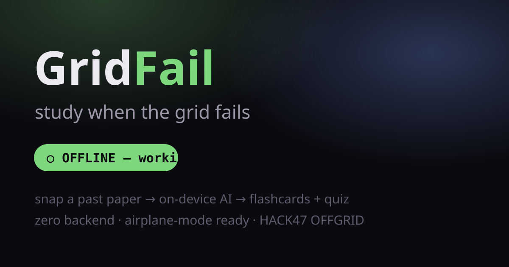
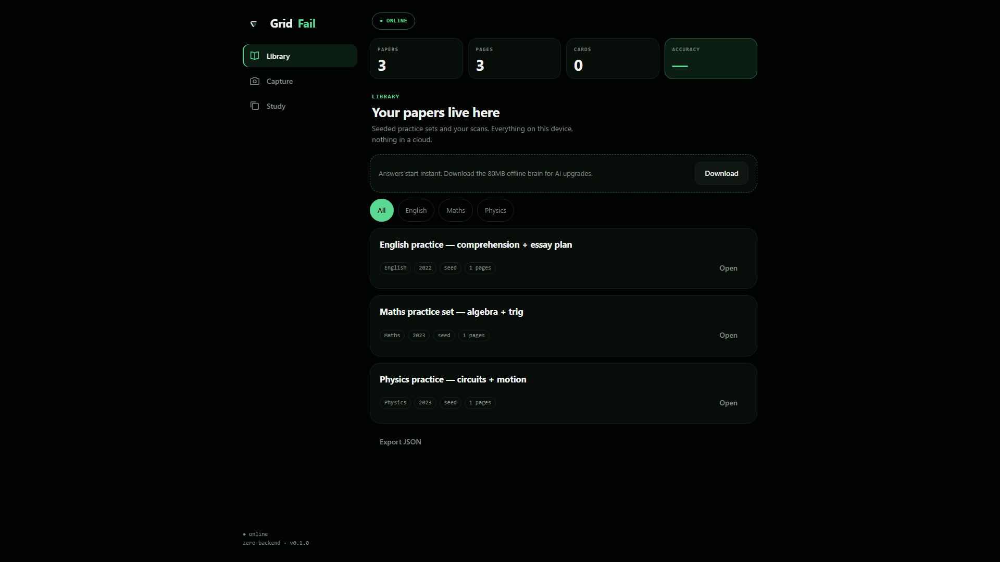
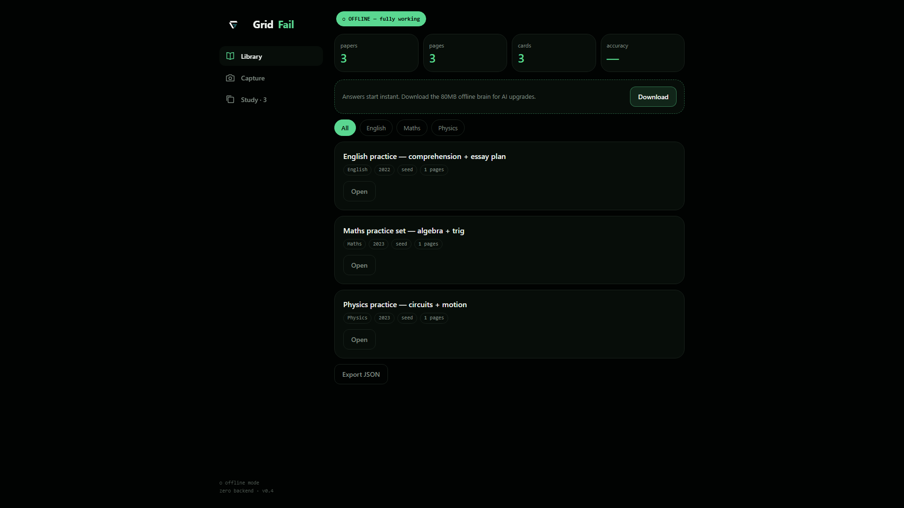
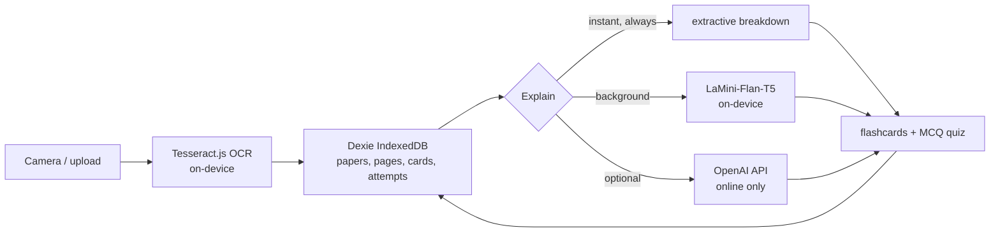

# GridFail — study when the grid fails



**One line:** an offline-first study kit. Snap a past paper, get explanations,
flashcards and quizzes with the wifi off.

**Why it exists:** load-shedding kills study sessions across South Africa, and
my own school network blocks the AI model downloads most study tools depend
on. So instant answers are the default and AI is the bonus, never the
requirement. Built solo for [HACK47 OFFGRID](https://hack47-offgrid.devpost.com).

## 60-second demo
1. Open the installed app, flip on airplane mode — pill goes green: OFFLINE.
2. Snap a matric past-paper photo → text extracted on-device.
3. Tap Explain → breakdown + flashcards in milliseconds.
4. Study tab → multiple-choice quiz, weakest-first, score persists.
5. Banner stays green throughout. Nothing phones home.

Demo video: `out/gridfail-demo.mp4` (90s, captioned) — YouTube link lands here
before submission.

## Screenshots (real app, headless capture)



## Architecture (zero backend)

Every answer is labeled `instant`, `on-device AI`, or `cloud`. Unfinished work
shows as disabled, never mocked.

## Stack
Vite + React + TS · vite-plugin-pwa · Dexie · Tesseract.js ·
@huggingface/transformers (LaMini-Flan-T5-77M) · Framer Motion.
Optional online fallback via `VITE_OPENAI_KEY` (never committed).

## Run it
```bash
npm install
npm run dev
```

## Offline AI model
Answers work fully offline out of the box (instant tier). For AI upgrades,
hit Download in the app once on good wifi (~80MB, cached by the service
worker). School/work networks often block the model CDN — the app says so
honestly and keeps working. Vendoring: drop the model snapshot into
`public/models/` (see TODO.md).

## Docs
- `SUBMISSION.md` — Devpost submission draft
- `DEMO.md` — 90-second demo script (written before the code rush)
- `BUILDLOG.md` — how-it-was-built story
- `TODO.md` — honest shortcuts, nothing faked
- `docs/superpowers/specs/2026-09-27-gridfail-design.md` — frozen MVP spec

Built with AI assistance for scaffolding and component adaptation;
architecture and integration by [@devwez](https://github.com/devwez).
