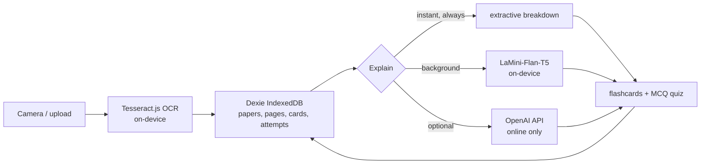

# GridFail — study when the grid fails


**An offline-first study kit.** Snap a past paper, get explanations,
flashcards and quizzes — with the wifi off. Built for load-shedding season,
hostel wifi that dies every evening, and school networks that block AI model
downloads.

> Built solo for [HACK47 OFFGRID](https://hack47-offgrid.devpost.com).
> Live demo: **https://gridfail.vercel.app**

## Why it exists

Every AI study tool assumes permanent internet. When the grid fails, studying
stops — and the learners hit hardest are the ones who can least afford it. So
GridFail flips the default: **instant answers work at 0MB downloaded**, and
on-device AI is a background upgrade, never a requirement.

## Features

- **Photo → text on-device.** Tesseract.js OCR reads photographed past papers.
  Nothing uploads anywhere.
- **Two-tier explanations.** An extractive breakdown renders in milliseconds;
  LaMini-Flan-T5 (~80MB, cached by the service worker) upgrades it quietly in
  the background. Every answer is labeled `instant`, `on-device AI`, or `cloud`.
- **Flashcards + MCQ quizzes.** Auto-generated from explanations, weakest-first
  ordering, scores persist in IndexedDB.
- **Honest offline pill.** A same-origin probe every 3 seconds — green means
  genuinely offline-capable, verified with the network actually cut.
- **Installable PWA.** Install once over any connection, study forever after.
- **Optional cloud fallback.** Bring your own OpenAI key for online sessions;
  the key lives in your browser and is never committed.

## 60-second demo

1. Open the installed app, flip on airplane mode — pill goes green: OFFLINE.
2. Snap a past-paper photo → text extracted on-device.
3. Tap Explain → breakdown + flashcards in milliseconds.
4. Study tab → multiple-choice quiz, weakest-first, score persists.
5. Banner stays green throughout. Nothing phones home.

Demo video: `out/gridfail-demo.mp4` (90s, captioned).

## Screenshots

Real app, headless capture with the network cut:


## Quickstart

```bash
npm install
npm run dev
```

Open http://localhost:5173. For the full experience: visit once on good wifi,
hit **Download** in the app to cache the AI model (~80MB), then go airplane
mode and everything keeps working.

| Command         | What                        |
| --------------- | --------------------------- |
| `npm run dev`   | Start dev server            |
| `npm run build` | Type-check + production build |
| `npm run test`  | Unit tests                  |
| `npm run lint`  | Lint                        |

## Architecture (zero backend)



Unfinished work ships disabled, never mocked. Known shortcuts are tracked
openly in [TODO.md](TODO.md).

## Project layout

```
src/
  lib/
    ai.ts    — two-tier explain (instant + background upgrade)
    db.ts    — Dexie schema (papers, pages, cards, attempts)
    ocr.ts   — on-device OCR wrapper
    seed.ts  — built-in practice prompts (written, not scraped)
  App.tsx    — shell, tabs, quiz, offline pill
remotion/    — 90s demo video composition (re-render: npm run remotion)
shots.cjs    — headless screenshot pipeline
docs/        — specs and design notes
```

## Docs

- [SUBMISSION.md](SUBMISSION.md) — Devpost submission draft
- [DEMO.md](DEMO.md) — 90-second demo script (written before the code rush)
- [BUILDLOG.md](BUILDLOG.md) — how-it-was-built story
- [TODO.md](TODO.md) — honest shortcuts, nothing faked
- [CHANGELOG.md](CHANGELOG.md) — release history
- [CONTRIBUTING.md](CONTRIBUTING.md) — how to help
- [SECURITY.md](SECURITY.md) — reporting vulnerabilities

## Roadmap

- [ ] Full CAPS corpus seed + spaced repetition
- [ ] Downscale large scans before IndexedDB save (bloat cap)
- [ ] Sub-50KB SMS fallback mode for phones that can't run the model
- [ ] Cloud sync (opt-in, encrypted) — export JSON works today

## Contributing

Offline-first is the law here — see [CONTRIBUTING.md](CONTRIBUTING.md).
Small, focused PRs. `npm run lint && npm run test && npm run build` before
pushing.

## License

MIT — see [LICENSE](LICENSE). Built with AI assistance for scaffolding;
architecture and integration by [@devwez](https://github.com/devwez).
