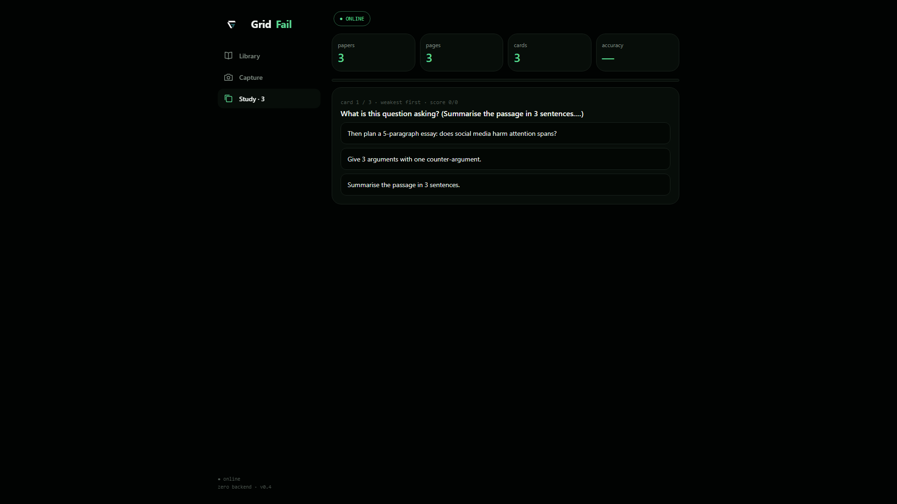
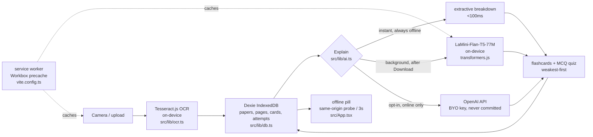

<div align="center">
  <a href="https://gridfail.vercel.app">
    
  </a>

  <h1 align="center">GridFail — study when the grid fails</h1>

  <p align="center"><b>An offline-first PWA study kit. Snap a past paper, get explanations, flashcards and quizzes — with the wifi off.</b></p>

  <p align="center">
    <a href="https://github.com/devwez/gridfail/actions/workflows/ci.yml"></a>
    <a href="LICENSE"></a>
    
    
    
  </p>

  <p align="center">
    <a href="https://gridfail.vercel.app"><b>Live demo</b></a>
    ·
    <a href="SUBMISSION.md">Devpost draft</a>
    ·
    <a href="TODO.md">Honest TODO</a>
    ·
    <a href="https://hack47-offgrid.devpost.com">HACK47 OFFGRID</a>
  </p>

  <p align="center"><i>Built solo for <a href="https://hack47-offgrid.devpost.com">HACK47 OFFGRID</a>. Install once over any connection, study forever after.</i></p>
</div>

---

**Language:** TypeScript (React 19 + Vite). **Backend:** none — 100% client-side, all data in IndexedDB.

## Table of contents

- [Why it exists](#why-it-exists)
- [How it works](#how-it-works)
- [Features](#features)
- [Screenshots](#screenshots)
- [60-second demo](#60-second-demo)
- [Try it now — no install](#try-it-now--no-install)
- [Getting started](#getting-started)
- [Deploy](#deploy)
- [Troubleshooting](#troubleshooting)
- [Architecture](#architecture)
- [Project layout](#project-layout)
- [Stack](#stack)
- [Docs](#docs)
- [Roadmap](#roadmap)
- [Contributing](#contributing)
- [Security](#security)
- [Follow the builder](#follow-the-builder)
- [License](#license)

## Why it exists

Every AI study tool assumes permanent internet. In South Africa load-shedding kills connectivity exactly when matric learners need to study; in hostels shared wifi collapses every evening; school networks block model downloads. When the grid fails, studying stops — and the learners hit hardest are the ones who can least afford it.

GridFail flips the default: **instant answers work at 0MB downloaded**, and on-device AI is a background upgrade, never a requirement.

## How it works

1. **Capture** — photograph a past paper. [Tesseract.js OCR](src/lib/ocr.ts) extracts text on-device. Nothing uploads anywhere.
2. **Explain** — an extractive breakdown renders in milliseconds. If the local model (`Xenova/LaMini-Flan-T5-77M`, ~80MB, cached by the service worker) is downloaded, it upgrades the answer quietly in the background. Every answer is labeled `instant`, `local`, or `cloud`. See [`src/lib/ai.ts`](src/lib/ai.ts).
3. **Study** — explanations turn into flashcards and multiple-choice quizzes ([`src/lib/ai.ts` — `makeCards`](src/lib/ai.ts)), weakest-first ordering, scores persisted as attempts in IndexedDB ([`src/lib/db.ts`](src/lib/db.ts)).
4. **Proof** — a same-origin probe every 3 seconds drives the offline pill: green means genuinely offline-capable, verified with the network cut ([`src/App.tsx` — `useOnline`](src/App.tsx)).
5. **Seed** — first run ships with written (not scraped) CAPS-style practice prompts so the app is useful fully offline from second zero ([`src/lib/seed.ts`](src/lib/seed.ts)).

Unfinished work ships disabled, never mocked. Known shortcuts are tracked openly in [TODO.md](TODO.md).

## Features

| Feature | What it does | Code |
| ------- | ------------ | ---- |
| Photo → text on-device | Tesseract.js OCR (`eng` worker, lazy-loaded) reads photographed past papers | [`src/lib/ocr.ts`](src/lib/ocr.ts) |
| Two-tier explanations | Instant extractive breakdown (<100ms, always offline), then background upgrade to local model or optional cloud key | [`src/lib/ai.ts`](src/lib/ai.ts) (`instant`, `prefetchModel`, `upgrade`) |
| On-device model, cached | LaMini-Flan-T5-77M via `@huggingface/transformers`; vendored weights in `public/models/` load first, CDN second | [`src/lib/ai.ts`](src/lib/ai.ts), [`vite.config.ts`](vite.config.ts) |
| Flashcards + MCQ quizzes | Auto-generated from explanations, weakest-first ordering, attempts persist in IndexedDB | [`src/lib/ai.ts`](src/lib/ai.ts), [`src/lib/db.ts`](src/lib/db.ts), [`src/App.tsx`](src/App.tsx) |
| Honest offline pill | Same-origin `HEAD /favicon.svg` probe every 3s — green means verified offline, not `navigator.onLine` guesswork | [`src/App.tsx`](src/App.tsx) |
| Installable PWA | `vite-plugin-pwa` manifest + Workbox precache (`js/css/html/svg/png/json`); standalone display, maskable icons | [`vite.config.ts`](vite.config.ts), [`index.html`](index.html) |
| Library of papers | Papers, pages, cards, attempts in Dexie tables (`papers`, `pages`, `cards`, `attempts`) | [`src/lib/db.ts`](src/lib/db.ts) |
| Seed content | 3 written CAPS-style practice sets (Maths, Physics, English) seeded on first run | [`src/lib/seed.ts`](src/lib/seed.ts) |
| Optional cloud fallback | Bring-your-own OpenAI key for online sessions; key lives in the browser, never committed | [`src/lib/ai.ts`](src/lib/ai.ts) |
| JSON export | No cloud sync — export JSON works today | [`src/App.tsx`](src/App.tsx) |
| Demo pipeline | 90s Remotion composition + headless screenshot script with network cut | [`remotion/`](remotion/), [`shots.cjs`](shots.cjs) |

## Screenshots

Real app, headless capture with the network cut (`shots.cjs`):

<p align="center">
  
  
</p>
<p align="center">
  
  
</p>

Devpost-size copies live in [`public/`](public/) (`devpost-01-library.png` … `devpost-04-offline.png`, `devpost-thumb.png`). Source screenshots: [`public/shots/`](public/shots/).

## 60-second demo

1. Open the installed app, flip on airplane mode — pill goes green: OFFLINE.
2. Snap a past-paper photo → text extracted on-device.
3. Tap Explain → breakdown + flashcards in milliseconds.
4. Study tab → multiple-choice quiz, weakest-first, score persists.
5. Banner stays green throughout. Nothing phones home.

Demo video: `out/gridfail-demo.mp4` (90s, captioned — see [DEMO.md](DEMO.md) for the script). Voiceover: [`public/voiceover.mp3`](public/voiceover.mp3).

## Try it now — no install

**Try it now — no install: https://gridfail.vercel.app** (live instance, auto-deploys from `main`).

30-second check:

1. Open https://gridfail.vercel.app on good wifi.
2. Hit **Download** in the app to cache the AI model (~80MB).
3. Flip on airplane mode.
4. Snap or upload a past-paper photo → tap **Explain**.

Expected: pill reads `○ OFFLINE — fully working`, explanation renders instantly.

## Getting started

Requirements: **Node 20+**, npm. First run downloads OCR + model assets on demand — use good wifi once, hit **Download** in the app to cache the AI model (~80MB), then test everything in airplane mode.

**Windows (PowerShell):**

```powershell
git clone https://github.com/devwez/gridfail.git
cd gridfail
npm install
npm run dev
```

Open http://localhost:5173.

**macOS / Linux:**

```bash
git clone https://github.com/devwez/gridfail.git
cd gridfail
npm install
npm run dev
```

Open http://localhost:5173.

| Command | What |
| ------- | ---- |
| `npm run dev` | Start dev server (http://localhost:5173) |
| `npm run build` | Type-check (`tsc -b`) + production build |
| `npm run test` | Unit tests (`vitest run` — see [`src/ai.test.ts`](src/ai.test.ts)) |
| `npm run lint` | Lint (`oxlint`) |
| `npm run preview` | Preview the production build locally |

```text
1. Visit https://gridfail.vercel.app on good wifi
2. Hit Download in the app (~80MB model, cached by the service worker)
3. Flip on airplane mode
4. Snap/upload a past paper → Explain
```

Expected output: pill shows `○ OFFLINE — fully working`, breakdown renders in milliseconds, answer labeled `instant` until the model upgrade lands (`local` or `cloud`).

Full offline check: visit once on good wifi → **Download** in the app (~80MB model) → airplane mode → everything keeps working.

## Deploy

There is no backend to deploy — any static host works. The live instance runs on Vercel:

| Platform | Status |
| -------- | ------ |
| [Vercel (live)](https://gridfail.vercel.app) | Production — auto-deploys from `main` |
| Any static host (`npm run build` → `dist/`) | Works — point it at `dist/` |

No one-click template buttons are provided — the repo is a hackathon build, not a starter template. To run your own copy:

[](https://vercel.com/new/clone?repository-url=https://github.com/devwez/gridfail)

(Vercel reads `vite.config.ts` defaults — no extra config needed. Any static host also works: `npm run build` → `dist/`. Netlify Drop: drag the `dist/` folder onto [app.netlify.com/drop](https://app.netlify.com/drop).)

## Troubleshooting

| Symptom | Cause | Fix |
| ------- | ----- | --- |
| `Download blocked: this network cannot reach the model CDN (school/work wifi often blocks it)...` | School/work networks block Hugging Face's CDN (hit this on the school network during the build — see [BUILDLOG.md](BUILDLOG.md)) | Retry on home wifi, or vendor weights into `public/models/` (see [TODO.md](TODO.md)). Instant answers keep working meanwhile. |
| `Download failed (<detail>). Retry online.` | Generic fetch failure mid-download | Retry on a stable connection; the retry starts fresh (`src/lib/ai.ts` — `prefetchModel`). |
| Blank library / missing papers in private mode | Private windows restrict `localStorage`/`IndexedDB` persistence | Use a normal window; the app catches the storage throw and continues with instant answers, but nothing persists. |
| Pill stuck on `● ONLINE` with wifi off | Captive portal or OS-level proxy still answering the probe | Flip full airplane mode, not just wifi off; the pill is a same-origin probe every 3s (`src/App.tsx` — `useOnline`), not a `navigator.onLine` guess. |

Open shortcuts log: [TODO.md](TODO.md) tracks every known shortcut. Submission state: [SUBMISSION.md](SUBMISSION.md) is a draft — the demo-video field is still an unlisted-YouTube TODO, so no video link is claimed. Rendered cut lives at `out/gridfail-demo.mp4`.

## Architecture

Zero backend. All compute and storage in the browser.



Data model ([`src/lib/db.ts`](src/lib/db.ts)): `papers(id, subject)` → `pages(id, paperId)` → `cards(id, pageId)` + `attempts(id, pageId)`. Scan images store as dataURL on the page row (bloat cap planned — see [TODO.md](TODO.md)).

## Project layout

```
src/
  App.tsx      — shell, tabs (library/capture/study), quiz, offline pill
  main.tsx     — entry
  App.css / index.css / assets/
  lib/
    ai.ts      — two-tier explain (instant + background upgrade), makeCards
    ai.test.ts — unit tests for the explain layer
    db.ts      — Dexie schema (papers, pages, cards, attempts)
    ocr.ts     — on-device OCR wrapper (Tesseract.js)
    seed.ts    — built-in practice prompts (written, not scraped)
remotion/      — 90s demo video composition
shots.cjs      — headless screenshot pipeline (network cut)
public/
  mark.png / icon-*.png / favicon.svg — PWA icons
  shots/       — app screenshots
  models/      — optional vendored model weights (see src/lib/ai.ts)
docs/          — specs and design notes
.github/       — CI workflow, issue + PR templates
```

## Stack

| Layer | Choice | Why |
| ----- | ------ | --- |
| UI | Vite + React 19 + TypeScript | Fast dev, strict types |
| Motion | Framer Motion | Tab transitions |
| Storage | Dexie (IndexedDB) | Structured offline persistence, no backend |
| OCR | Tesseract.js (`eng`) | On-device text extraction, lazy-loaded |
| On-device AI | `@huggingface/transformers` + `Xenova/LaMini-Flan-T5-77M` | Small enough to cache in a PWA (~80MB) |
| PWA | `vite-plugin-pwa` (Workbox) | Manifest, auto-update SW, asset precache |
| Cloud (optional) | OpenAI API, BYO key | Online fallback only, never required |
| Tests / lint | Vitest, oxlint | `npm run test`, `npm run lint` |
| Video | Remotion | 90s demo composition in [`remotion/`](remotion/) |

## Docs

| Doc | What |
| --- | ---- |
| [SUBMISSION.md](SUBMISSION.md) | Devpost submission draft (problem, solution, stack, build log) |
| [DEMO.md](DEMO.md) | 90-second demo script (written before the code rush) |
| [BUILDLOG.md](BUILDLOG.md) | How-it-was-built story |
| [TODO.md](TODO.md) | Honest shortcuts, nothing faked |
| [CHANGELOG.md](CHANGELOG.md) | Release history |
| [CONTRIBUTING.md](CONTRIBUTING.md) | How to help (offline-first is law) |
| [SECURITY.md](SECURITY.md) | Reporting vulnerabilities |
| [CODE_OF_CONDUCT.md](CODE_OF_CONDUCT.md) | Community conduct |

## Roadmap

- [ ] Full CAPS corpus seed + spaced repetition
- [ ] Downscale large scans before IndexedDB save (bloat cap)
- [ ] Sub-50KB SMS fallback mode for phones that can't run the model
- [ ] Cloud sync (opt-in, encrypted) — export JSON works today

Tracked with context in [TODO.md](TODO.md) and [SUBMISSION.md](SUBMISSION.md).

## Contributing

Offline-first is the law here — see [CONTRIBUTING.md](CONTRIBUTING.md).

1. Fork, branch off `main` (`feat/quiz-timer`, `fix/ocr-crop`).
2. Keep changes tight — one concern per PR.
3. Run checks before pushing:
   ```bash
   npm run lint
   npm run test
   npm run build
   ```
4. Open a PR with the template filled in: what, why, how you tested (including an offline pass if you touched runtime code).

Small, focused PRs. `npm run lint && npm run test && npm run build` before pushing.

## Security

Supported: `0.1.x` (pre-1.0 — fixes land on the latest minor). Full policy: [SECURITY.md](SECURITY.md).

To report: email **ekhore111@gmail.com** with what you found, steps to reproduce, and impact. Reply within 7 days. Don't open a public issue for vulnerabilities.

Scope notes: no backend, no accounts — all data stays in the browser's IndexedDB. The optional OpenAI fallback uses a user-supplied key stored locally. Model/OCR assets load from public CDNs pinned in the service worker; supply-chain concerns there are in scope.

## Follow the builder

- GitHub: [@devwez](https://github.com/devwez)
- X: [@devwez](https://x.com/devwez)
- Site: [weza.digital](https://weza.digital)
- Source: [github.com/devwez/gridfail](https://github.com/devwez/gridfail)
- Live: [gridfail.vercel.app](https://gridfail.vercel.app)

## License

MIT — see [LICENSE](LICENSE). Built with AI assistance for scaffolding; architecture and integration by [@devwez](https://github.com/devwez).
